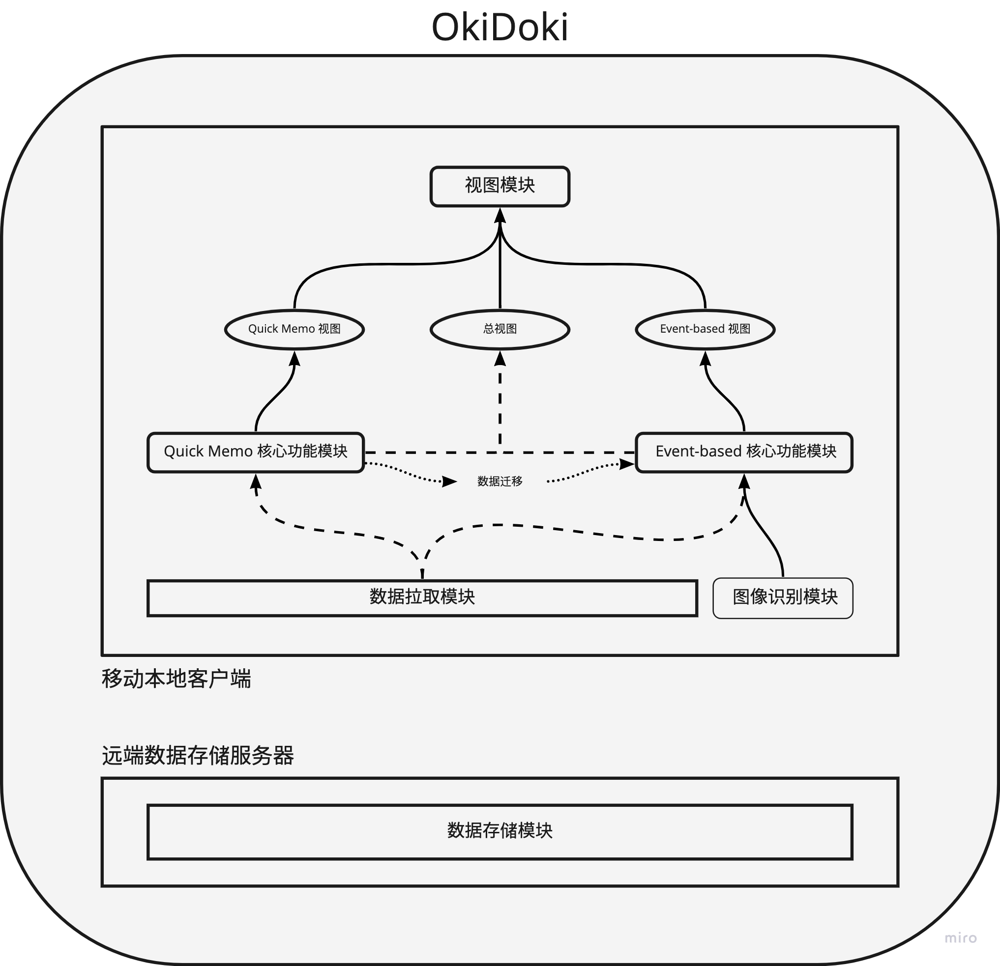
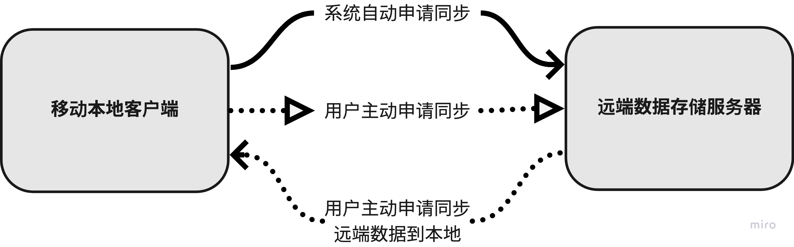

# 设计文档 - 技术规格说明书

[toc]

## 技术栈

**程序设计语言**：JavaScript

**应用开发框架**：React Native

**开发环境：**Node.js

**运行环境**：Android ( + iOS )

## 子系统

本地客户端 + 远端数据存储服务器。

### 移动本地客户端

包含用户使用OkiDoki时除了同步数据到远端的所有功能：

* Quick Memo：迅速记录待办事件，如突然接到的通知
* EventSrc-based：针对某个事项的待办，如针对某一科的作业、考研的具体复习任务等
* 三个视图：

    * 总视图：以天为单位显示两个功能下在这一天的所有任务，默认智能排序
    * Quick Memo视图：所有速记待办事件
    * EventSrc-based视图：事项列表，每一个事项列表下可以有多个常规计划和速记待办事件，可选按照DDL或优先度排序或智能排序

#### 模块

1. 视图模块：总视图、Quick Memo视图、EventSrc-based视图
2. Quick Memo核心功能模块
3. EventSrc-based核心功能模块
4. 图像识别模块（拍照识别书籍目录）

### 远端数据存储服务器

包含用户主动申请或系统自动的数据保存、迁移功能：

* 系统自动设置云同步，用户可以自己设置同步频率
* 用户主动申请云同步数据

#### 模块

1. 数据存储模块
2. 数据拉取模块

### 模块间关系

### 子系统间关系

